# 🇨🇦 Canada Tech Job Compass 2026

> **Comprehensive tech job market analysis across 7 Canadian cities** - Helping job seekers find their optimal career opportunities through data-driven insights.

[](https://www.python.org/downloads/)
[](https://opensource.org/licenses/MIT)
[](https://github.com/psf/black)

---

## 📊 Project Overview

**Canada Tech Job Compass** analyzes **2,000+ live tech job postings** from the last 30 days across major Canadian cities to provide actionable insights for job seekers pursuing tech careers and PR pathways (SINP/OINP).

### 🎯 Target Insights

The system generates insights like:

- **"Toronto Data Analyst: 2.1y avg exp vs Toronto 4.3y - 65% junior roles"**
- **"DevOps: Docker+AWS required everywhere, Power BI > Tableau 3:1 in Prairies"**
- **"Vancouver +25% salary but +1.8y exp demand"**
- **"IT Support: 80% remote in Calgary/Winnipeg"**
- **"Easiest entry: Regina SK (42% junior roles across tech)"**

---

## 🚀 Features

### Data Collection
- ✅ Multi-source aggregation (Job Bank Canada, RapidAPI, RSS feeds)
- ✅ Intelligent web scraping with rate limiting and retry logic
- ✅ Automated deduplication and data validation
- ✅ 2,000+ jobs from 3+ sources

### Data Processing
- ✅ Regex + pattern-based feature extraction (experience, skills, seniority)
- ✅ 40+ tech skills in extractor; 100+ in skills_master reference
- ✅ Remote work detection (remote/hybrid/onsite)
- ✅ Multi-rule validation (province, city, salary, spam checks)

### Analysis & Insights
- ✅ Experience ladder by city and role
- ✅ Skills demand heatmap
- ✅ City competitiveness scoring
- ✅ Salary range analysis
- ✅ Entry-level job recommendations

### Visualization
- ✅ **Streamlit dashboard** – Charts and AI-powered natural language search *(run `streamlit run streamlit_app.py`)*
- ✅ **AI query** – Ask in plain English (e.g. "Find me Data Analyst jobs in Toronto"); LLM generates SQL, validation agent verifies intent
- ✅ Daily refresh pipeline

---

## 🛠 Tech Stack


| Layer | Technology | Purpose |
|-------|-----------|---------|
| **Language** | Python 3.11+ | Core development |
| **Database** | PostgreSQL (Supabase) | Data storage |
| **Web Scraping** | BeautifulSoup, Selenium | Data collection |
| **NLP** | spaCy | Feature extraction |
| **Data Processing** | pandas, numpy | Data manipulation |
| **Visualization** | Streamlit, Plotly | Interactive dashboard with AI search |
| **Scheduling** | APScheduler, GitHub Actions | Automation |
| **Testing** | pytest | Quality assurance |

---

## 📁 Project Structure

```mermaid
%%{init: {'theme':'base', 'themeVariables': { 'primaryColor':'#0ea5e9'}}}%%
flowchart TB
    subgraph ROOT["JobMarket/"]
        subgraph SRC["src/"]
            C[collectors/]
            P[processors/]
            DB[database/]
            U[utils/]
            AI[ai/]
            AI2[backends/ · query_agent.py]
        end
        subgraph SQL["sql/"]
            S1[schema.sql]
            S2[seed_data.sql]
        end
        subgraph DOCS["docs/"]
            D1[setup.md]
            D2[PROJECT_JOURNEY.md]
            D3[analysis-queries.md]
        end
        CM[collect_multi_source.py]
        ST[streamlit_app.py]
        RUN[run.py]
        ENV[.env.example]
        REQ[requirements.txt]
    end
    
    AI --> AI2
    
    style SRC fill:#e0f2fe
    style SQL fill:#d1fae5
    style DOCS fill:#fef3c7
    style CM fill:#6366f1
    style ST fill:#6366f1
    style RUN fill:#6366f1
```



| Path | Purpose |
|------|---------|
| `src/collectors/` | Job Bank, Adzuna, JSearch, LinkedIn, RemoteOK, RSS |
| `src/processors/` | Validation, deduplication, feature extraction |
| `src/database/` | ORM models, connection, storage |
| `src/ai/` | AI query agent (NL → SQL + validation) |
| `sql/` | Database schema and queries |
| `docs/` | Setup, PROJECT_JOURNEY, analysis-queries |
| `collect_multi_source.py` | Main collector |
| `streamlit_app.py` | Dashboard with AI search |
| `run.py` | CLI (process, analyze, stats) |

---

## 🚦 Quick Start

### Prerequisites
- Python 3.11+
- Git
- Chrome/Chromium (for Selenium)
- Supabase account (free tier)
- RapidAPI account (free tier)

### Installation (5 minutes)

```bash
# 1. Clone repository
git clone https://github.com/NevilPatel01/JobMarketResearch.git
cd JobMarketResearch

# 2. Create virtual environment
python3 -m venv venv
source venv/bin/activate  # macOS/Linux
# venv\Scripts\activate   # Windows

# 3. Install dependencies
pip install -r requirements.txt
python -m spacy download en_core_web_sm

# 4. Configure environment
cp .env.example .env
# Edit .env with your Supabase and RapidAPI credentials

# 5. Set up database
# Run sql/schema.sql in Supabase SQL Editor
# Run sql/seed_data.sql to populate skills

# 6. Verify setup
python run.py stats
```

**For detailed setup instructions**, see [`docs/setup.md`](docs/setup.md).

---

## 📖 Usage

### Interactive Dashboard (Recommended)

```bash
# Install dashboard deps (if not already)
pip install streamlit plotly

# Launch the visual dashboard
streamlit run streamlit_app.py
```

Opens a browser with charts and **AI-powered search** – ask in natural language (e.g. "Data Analyst jobs in Toronto"). Uses Ollama by default; set `LLM_PROVIDER=openai` for OpenAI.

### Collect Jobs (CLI)

```bash
# Multi-source collection (Job Bank, Adzuna, JSearch, LinkedIn, RemoteOK, etc.)
python collect_multi_source.py --sources jobbank jsearch adzuna linkedin remoteok

# Or specific sources only
python collect_multi_source.py --sources jobbank adzuna

# Process raw jobs (validate, dedupe, extract features)
python run.py process

# Terminal analysis (or use Streamlit dashboard)
python run.py analyze --days 90

# Job Bank only (fewer sources)
python run.py collect --city Toronto --city Vancouver --role "data analyst" --pages 3
```

### Programmatic Usage

```python
import sys
sys.path.insert(0, "src")

from database.connection import DatabaseConnection
from database.storage import JobStorage
from processors.validator import JobValidator
from processors.feature_extractor import FeatureExtractor

# Collect: run collect_multi_source.py or use collectors directly
from collectors.adzuna_collector import AdzunaCollector
collector = AdzunaCollector()
jobs = collector.collect_with_validation("Toronto", "data analyst", 2)

# Validate and extract features
validator = JobValidator(strict_mode=False)
valid, invalid = validator.validate_batch(jobs)
extractor = FeatureExtractor()
features = extractor.extract_batch(valid)
```

---

## 📊 Data Pipeline


**Total Runtime**: ~60 minutes for full pipeline

---

## 📊 Streamlit Dashboard with AI Search

```bash
streamlit run streamlit_app.py
```



```mermaid
%%{init: {'theme':'base', 'themeVariables': { 'primaryColor':'#6366f1','primaryTextColor':'#fff'}}}%%
flowchart LR
    subgraph USER["👤 User"]
        A["Natural language query\n'Data Analyst in Toronto'"]
    end
    
    subgraph AI["🤖 AI Layer"]
        B[Simple pattern match?]
        C[Ollama / OpenAI]
        D[Generate SQL]
        E[Validation agent]
    end
    
    subgraph DB["🗄️ Database"]
        F[PostgreSQL]
    end
    
    subgraph OUT["📋 Output"]
        G[Job results table]
        H[LinkColumn URLs]
    end
    
    A --> B
    B -->|Yes| F
    B -->|No| C
    C --> D --> E --> F
    F --> G --> H
    
    style A fill:#e0e7ff
    style C fill:#c7d2fe
    style D fill:#a5b4fc
    style E fill:#818cf8
    style F fill:#10b981
    style G fill:#34d399
```

- **Overview tab** – Charts for jobs by source, cities, roles, skills, salary, experience ladder
- **Ask AI tab** – Natural language queries (e.g. "Find me Data Analyst jobs in Toronto"). LLM converts to SQL, a validation agent checks it matches your intent, then results are shown.

**Plug-and-play LLM**: Default is **Ollama** (local) – run `ollama serve` and `ollama pull llama3.2`. Or set `LLM_PROVIDER=openai` and `OPENAI_API_KEY` for OpenAI.

---

## 🔍 Key Analyses

### Experience Requirements
```sql
SELECT city, title as role, 
       AVG(exp_min) as avg_exp, 
       COUNT(*) * AVG(is_junior::int) as junior_jobs
FROM jobs_raw jr
JOIN jobs_features jf ON jr.job_id = jf.job_id
GROUP BY city, title
ORDER BY junior_jobs DESC;
```

### Skills Demand
```sql
SELECT skill, COUNT(*) as demand
FROM jobs_features
CROSS JOIN jsonb_array_elements_text(skills) as skill
GROUP BY skill
ORDER BY demand DESC
LIMIT 20;
```

### City Opportunity Score
```sql
-- Use vw_city_stats or run:
SELECT jr.city, jr.province,
       COUNT(*) as total_jobs,
       ROUND(100.0 * AVG(jf.is_junior::int), 1) as junior_pct,
       ROUND(100.0 * AVG(CASE WHEN jr.remote_type IN ('remote','hybrid') THEN 1 ELSE 0 END), 1) as remote_pct,
       ROUND(AVG(jr.salary_mid)) as avg_salary
FROM jobs_raw jr
LEFT JOIN jobs_features jf ON jr.job_id = jf.job_id
WHERE jr.posted_date >= CURRENT_DATE - INTERVAL '30 days'
GROUP BY jr.city, jr.province
ORDER BY junior_pct DESC, remote_pct DESC;
```

**Full query library**: See [`docs/analysis-queries.md`](docs/analysis-queries.md)

---

## 🧪 Testing

```bash
# Quick validation
python run.py stats
python -c "import sys; sys.path.insert(0,'src'); from database.connection import DatabaseConnection; DatabaseConnection(); print('DB OK')"
```

---

## 🗂 Data Sources

| Source | Type | API Key | Rate Limit |
|--------|------|---------|------------|
| **Job Bank Canada** | Web Scraping | None | 2.5s/request |
| **Adzuna** | REST API | Free (developer.adzuna.com) | Generous |
| **JSearch** | RapidAPI | RAPIDAPI_KEY | Varies |
| **LinkedIn Jobs** | RapidAPI | RAPIDAPI_KEY | Varies |
| **RemoteOK** | REST API | None | Unlimited |
| **Indeed RSS** | RSS Feed | None | May be limited |
| **Workopolis RSS** | RSS Feed | None | May be limited |

**Collect with**: `python collect_multi_source.py --sources jobbank adzuna jsearch linkedin remoteok`

---

## 📅 Automation

### Daily Scheduled Pipeline

GitHub Actions workflow (`.github/workflows/daily_scrape.yml`) runs daily at 7 AM UTC:

1. Collects from Job Bank, Adzuna, RemoteOK
2. Processes raw jobs (extract features)
3. Refreshes materialized view

**Secrets to add** (Repo → Settings → Secrets): `SUPABASE_DB_POOLER_URL`, `ADZUNA_APP_ID`, `ADZUNA_APP_KEY`. Optional: `RAPIDAPI_KEY` for JSearch/LinkedIn.

### Local Scheduling

```python
# Use APScheduler
from apscheduler.schedulers.blocking import BlockingScheduler
import subprocess

scheduler = BlockingScheduler()

@scheduler.scheduled_job('cron', hour=2, minute=0)
def daily_scrape():
    subprocess.run(["python", "collect_multi_source.py", "--sources", "jobbank", "adzuna"])
    subprocess.run(["python", "run.py", "process"])

scheduler.start()
```

---

## 🤝 Contributing

I welcome contributions! Please follow these steps:

1. Fork the repository
2. Create feature branch: `git checkout -b feature/amazing-feature`
3. Follow code style: Run `black src/ && isort src/`
4. Add tests: Coverage must remain >85%
5. Commit: `git commit -m 'feat: add amazing feature'`
6. Push: `git push origin feature/amazing-feature`
7. Open Pull Request

**Code Style**: I use Black (line length 100), isort, and type hints.

---

## 📝 Documentation

Comprehensive guides available in [`docs/`](docs/):

- [`setup.md`](docs/setup.md) - Detailed setup instructions
- **[`PROJECT_JOURNEY.md`](docs/PROJECT_JOURNEY.md)** - Build story: what I did, what failed, how I fixed it *(for hiring managers & curious users)*
- [`architecture.md`](docs/architecture.md) - System design and components
- [`api-integration.md`](docs/api-integration.md) - API usage and scraping
- [`data-pipeline.md`](docs/data-pipeline.md) - Pipeline stages explained
- [`analysis-queries.md`](docs/analysis-queries.md) - SQL query reference

---

## 🔒 Security

- ✅ All secrets in `.env` (never committed)
- ✅ API keys stored in environment variables
- ✅ Rate limiting on all external requests
- ✅ Personal data stripped from job descriptions
- ✅ Supabase Row Level Security (RLS) enabled

**Report security issues**: Please email security@example.com

---

## 📊 Success Metrics

Current status:

- ✅ 4,600+ jobs from Job Bank, Adzuna, RemoteOK, JSearch, LinkedIn
- ✅ Streamlit dashboard with AI natural language search
- ✅ Multi-source collection via `collect_multi_source.py`
- ✅ Feature extraction (experience, skills, remote)
- ✅ GitHub Actions workflow for daily refresh (optional)

---

## 🚧 Roadmap

### Phase 1 
- [x] Multi-source data collection (collect_multi_source.py)
- [x] Feature extraction (exp, skills, remote)
- [x] Basic analysis (CLI + Streamlit dashboard)
- [x] Streamlit dashboard with AI NL-to-SQL + validation agent

### Phase 2 
- [ ] ML salary predictor (XGBoost)
- [ ] Real-time job alerts
- [ ] LinkedIn integration
- [ ] Mobile-responsive dashboard

---

canada-jobs, tech-jobs, job-market-analysis, streamlit, python, postgresql, data-analytics, web-scraping, job-aggregator, supabase, ai, ollama, job-seekers, data-engineering, nlp

## 📄 License

This project is licensed under the MIT License - see the [LICENSE](LICENSE) file for details.

---

## 🙏 Acknowledgments

- **Job Bank Canada** for providing public job data
- **RapidAPI** for API marketplace
- **Supabase** for free PostgreSQL hosting
- **spaCy** for NLP capabilities
- **Open source community** for amazing tools

---

## 📧 Contact

**Project Maintainer**: Nevil Patel  
**GitHub**: [@NevilPatel01](https://github.com/NevilPatel01)  
**Project Link**: [https://github.com/NevilPatel01/JobMarketResearch](https://github.com/NevilPatel01/JobMarketResearch)

---

## 💡 For Job Seekers

This project is built **by job seekers, for job seekers**. My mission is to democratize access to job market insights and help you make informed career decisions.

**Using this project?** Share your success story! I'd love to hear how the data helped you land your dream job.

---

<div align="center">

**Made with ❤️ for the Canadian tech community**

[⭐ Star this repo](https://github.com/NevilPatel01/JobMarketResearch) • [🐛 Report Bug](https://github.com/NevilPatel01/JobMarketResearch/issues) • [💡 Request Feature](https://github.com/NevilPatel01/JobMarketResearch/issues)

</div>
