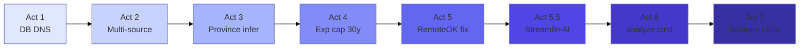

# The Canada Tech Job Compass: A Build Journal

> *How I went from an idea to 4,600+ live job postings, and what I learned when things broke along the way.*



---

## The Goal

I wanted to build something useful for tech job seekers in Canada: a system that aggregates job postings from multiple sources, extracts structure from messy text, and surfaces insights like *"Which city has the most junior-friendly data analyst roles?"* and *"What skills are employers actually asking for?"*

The target was ambitious: **5,000+ jobs** across major Canadian cities, with features like experience requirements, skills, and remote-work indicators. Simple to describe—harder to pull off when every API, database, and regex has its own quirks.

Here’s the story of what I built, what went wrong, and how I fixed it.

---

## Act 1: The Database That Wouldn’t Connect

**What I did:** Set up a PostgreSQL database on Supabase, configured the connection string, and wired the app to it.

**What went wrong:** When running the pipeline remotely, I hit:

```
could not translate host name "db.xxxxx.supabase.co"
```

The same connection string worked on another network but failed here. DNS resolution was the culprit—Supabase’s direct connection URL isn’t reliably resolvable from all networks.

**What I learned:** Supabase offers a *pooler* connection (transaction/session mode) for exactly this scenario. The direct URL works inside Supabase; external clients should use the pooler URL from the dashboard.

**What I fixed:**

1. Added `SUPABASE_DB_POOLER_URL` in config so I can paste the pooler URI from Supabase Dashboard → Settings → Database → Connection string.
2. Implemented `_create_engine_with_retry()` to try the pooler first, then fall back to trying multiple pooler regions (us-east-1, ca-central-1, eu-west-1, etc.) when the direct URL fails.
3. Improved error messages with a direct link to the Supabase Connect dialog.

**Takeaway:** Real-world infra behaves differently across environments. Building in fallbacks and clear, actionable errors saves time for anyone debugging later.

---

## Act 2: The Job Pool That Ran Dry

**What I did:** Job Bank Canada was the first source—free, structured, and government-backed. I scraped Toronto, Vancouver, Calgary, and more. It worked.

**What went wrong:** After a few runs, I was adding only a handful of new jobs each time. I was scraping hundreds of pages, but most were duplicates. The pool was effectively exhausted for my city/role combinations.

**What I learned:** One source isn’t enough for 5,000+ jobs. Job Bank overlaps with other aggregators, and I needed more providers.

**What I fixed:**

1. Added a **multi-source collector** (`collect_multi_source.py`) that orchestrates several APIs.
2. Integrated new sources:
   - **JSearch** (RapidAPI) – aggregates Indeed and others
   - **LinkedIn Jobs** (RapidAPI)
   - **Adzuna** – free API, strong Canada coverage
   - **RemoteOK** – free, no API key, remote roles
   - **Indeed RSS** and **Workopolis RSS**
3. Introduced an early-exit threshold in `collect_5000.py` so I stop once I see many consecutive batches with zero new inserts.

**Takeaway:** Diversifying data sources isn’t just about volume—it’s about resilience and avoiding single points of failure.

---

## Act 3: The Province That Wasn’t There

**What I did:** Wired up the Adzuna API. The docs looked straightforward: search by city and role, get job listings. My schema required a `province` field (2-letter code: ON, AB, BC) for Canadian locations.

**What went wrong:** Logs filled with:

```
WARNING - Job missing required key: province
WARNING - Filtered 8 invalid jobs
```

Hundreds of jobs were dropped. Adzuna returned location data, but in inconsistent shapes: sometimes `location.display_name`, sometimes `location.area`, sometimes neither with a clear province. City-only searches (e.g. “Ottawa”, “Edmonton”) often returned jobs without province info.

**What I learned:** APIs rarely give you exactly what your schema expects. I needed to infer province when it wasn’t explicit.

**What I fixed:**

1. Added `_province_from_name()` – maps known strings (“Ontario”, “Alberta”, “British Columbia”) to codes.
2. Added `_province_from_area()` – uses Adzuna’s `location.area` when present.
3. Built a city-to-province fallback: Ottawa → ON, Edmonton → AB, Vancouver → BC, etc.
4. Kept jobs I can confidently place in Canada; still drop those I can’t.

**Takeaway:** Real-world data is messy. Inferring missing values from context is often necessary; the alternative is losing good data.

---

## Act 4: The 500-Year-Old Candidate

**What I did:** Added a feature extractor to pull structured data from job text: experience ranges (e.g. “3–5 years”), skills (Python, AWS, SQL), remote vs. on-site.

**What went wrong:** Feature insertion started failing with:

```
numeric field overflow
A field with precision 4, scale 2 must round to an absolute value less than 10^2
```

`exp_avg` is `DECIMAL(4,2)`—so max 99.99. One job had `exp_min=500`, `exp_max=503`. The regex had matched salary figures (“$500,000–$503,000”) as years of experience.

**What I learned:** Regexes that look for number ranges will match anything numeric. Without bounds, salary ranges look like experience ranges.

**What I fixed:**

1. Capped experience at 30 years and treated anything above as a false positive.
2. Tightened `_extract_experience()` to skip matches when either value exceeds 30.
3. Added a post-extraction check to null out obviously wrong values.

**Bonus bug:** The experience-level formula had operator-precedence issues:

```python
# Wrong: (exp_min or 0 + exp_max or exp_min or 0)
# Right: ((exp_min or 0) + (exp_max or exp_min or 0)) / 2.0
```

**Takeaway:** Domain constraints (like “experience in years”) should be enforced in code. Errors are useful—they highlighted the edge case.

---

## Act 5: The Small Things That Stack Up

**What I did:** Brought in RemoteOK for remote jobs and ran the full pipeline.

**What went wrong:** Several small but blocking issues:

1. **RemoteOKCollector** – `BaseCollector` expects a config dict, but RemoteOK didn’t override `__init__`. Instantiation failed.
2. **Job URLs** – RemoteOK job URLs were built as `.../l/{slug}` instead of `.../remote-jobs/{slug}`; links were wrong.
3. **Salary ordering** – Job Bank sometimes had `salary_min > salary_max`; the DB rejects that. I wasn't normalizing before insert.

**What I fixed:**

1. Implemented `RemoteOKCollector.__init__(self, config=None)` and passed `config or {}` to the base class.
2. Corrected the RemoteOK URL format using the API’s `url` or `slug` field.
3. Added pre-insert logic in `storage.insert_raw_jobs()` and in the Job Bank collector to swap min/max when needed.

**Takeaway:** When integrating new sources, expect minor mismatches. Fixing them as you go keeps the system stable.

---

## Act 5.5: Power BI Not on macOS – Streamlit + AI

**What I did:** Wanted a visual dashboard. Power BI is not supported on macOS.

**What I built instead:** A Streamlit app plus AI integration. Users ask in natural language (e.g. "Find me Data Analyst jobs in Hamilton"). An LLM converts the question to SQL. A validation agent checks that the SQL correctly implements the user's intent; if not, it iterates with feedback until the query is right. Then I run it and show results.

**Takeaway:** When one tool doesn't fit (Power BI on macOS), adapt. Streamlit + LLM gives a flexible, cross-platform alternative.

---

## Act 6: From Raw Jobs to Insights

**What I did:** Raw jobs are only useful if they become structured data. I built a process pipeline: validate → deduplicate → extract features → store in `jobs_features`.

**What went wrong:** The `process` command existed, but it wasn’t obvious how to run analysis or see results. I needed a way to turn the data into something interpretable.

**What I fixed:**

1. Ran `process` on the full dataset—3,316 jobs got features.
2. Added an `analyze` command that:
   - Shows total jobs and breakdown by source
   - Reports top cities, roles, and skills
   - Summarizes salary (where available) and remote/flexible share
   - Highlights an “experience ladder” (city + role combinations most friendly to juniors)

**Takeaway:** Processing is only half the job. Exposing results through a clear interface makes the system usable.

---

## Act 7: Bad Salary Data and Filter Search Regex

**What I did:** Added a Filter Search tab with Job Title, Province, City, salary range, etc. I used PostgreSQL regex (`~*`) with `\Q...\E` for literal keyword matching so "Software" would match "Software Developer" and "Software Engineer".

**What went wrong:** Filter Search threw:

```
invalid regular expression: invalid escape \ sequence
```

With parameters like `{'job_title_0': '\\QData\\E', ...}`, PostgreSQL's regex engine rejected the `\Q` / `\E` sequences when passed as bound parameters. The escaping behaved differently than with inline SQL strings.

**What I learned:** Regex with bound parameters can be tricky across drivers. ILIKE with `ESCAPE '\\'` is simpler and avoids parameter/escape issues.

**What I fixed:**

1. Switched Job Title filter from regex (`~*`) back to ILIKE with proper escaping for `%` and `_`.
2. Kept the same behavior: split by spaces, require all keywords in the title (e.g. "Data Analyst" matches titles containing both).

**Bonus:** I also fixed bad salary data ($8–$35 hourly misparsed as annual): improved parsing, added a recrawl script, and filter out bad salaries in all queries.

**Takeaway:** When a "clever" approach (regex) breaks with bound params, fall back to the simpler one (ILIKE). It works reliably.

---

## Where I Am Now

| Metric             | Value                    |
|--------------------|--------------------------|
| Total jobs         | 4,677                    |
| Jobs with features | 3,451                    |
| Sources            | Job Bank, Adzuna, RemoteOK (plus JSearch, LinkedIn) |
| Top cities         | Toronto (1,233), Montréal (658), Calgary (445) |
| Remote/flexible    | ~14%                     |

The pipeline works. I can collect, process, and analyze. New sources can be added. Edge cases are handled more robustly.

---

## What This Taught Me

1. **Expect failure modes** – Databases, APIs, and regexes will misbehave. Design for it.
2. **Read error messages** – “numeric field overflow” pointed straight to bad experience values.
3. **Infer when needed** – APIs don’t always give province; I inferred it from city and area.
4. **Cap and constrain** – Experience > 30 years is a signal to reject, not to store.
5. **Improve errors** – Actionable messages (e.g. links to Supabase config) reduce debugging time.
6. **Ship iteratively** – Each bug was a chance to harden the system for the next run.

Building in public, fixing in public.

---

*Last updated: 21 February 2026*
