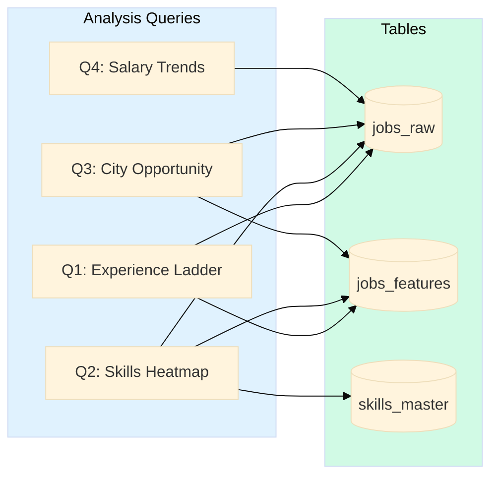

# Analysis Queries Documentation

## Overview
This document contains SQL queries for analyzing job market data and generating insights for Power BI dashboards. All queries target the last 30 days of job postings.

## Database Schema Reference

### Tables
- **jobs_raw**: Raw job postings with salary, location, posting date
- **jobs_features**: Extracted features (experience, skills, seniority)
- **skills_master**: Reference table of tech skills with categories

### Key Relationships

```mermaid
%%{init: {'theme':'base', 'themeVariables': { 'primaryColor':'#0ea5e9'}}}%%
erDiagram
    jobs_raw ||--o| jobs_features : "job_id"
    jobs_features }o--o{ skills_master : "skills"
    
    jobs_raw {
        varchar job_id PK
        varchar title
        varchar city
        varchar province
        date posted_date
        int salary_min
        int salary_max
    }
    
    jobs_features {
        varchar job_id PK_FK
        int exp_min
        int exp_max
        jsonb skills
        boolean is_junior
    }
    
    skills_master {
        varchar skill PK
        varchar category
    }
```

---

## Core Analysis Queries



### Q1: Experience Ladder by City and Role

**Purpose**: Identify cities/roles with lowest experience requirements (best for job seekers)

```sql
SELECT 
    jr.title as role,
    jr.city,
    jr.province,
    ROUND(AVG(jf.exp_min), 1) as avg_exp_min,
    ROUND(AVG(jf.exp_max), 1) as avg_exp_max,
    ROUND(AVG((jf.exp_min + COALESCE(jf.exp_max, jf.exp_min)) / 2.0), 1) as avg_exp_mid,
    ROUND(100.0 * AVG(jf.is_junior::int), 1) as junior_pct,
    COUNT(*) as job_count
FROM jobs_raw jr
JOIN jobs_features jf ON jr.job_id = jf.job_id
WHERE jr.posted_date >= CURRENT_DATE - INTERVAL '30 days'
  AND jf.exp_min IS NOT NULL
GROUP BY jr.title, jr.city, jr.province
HAVING COUNT(*) >= 5
ORDER BY junior_pct DESC, avg_exp_min ASC
LIMIT 50;
```

**Output Columns**:
- `role`: Job title (e.g., "Data Analyst")
- `city`: Canadian city name
- `avg_exp_min`, `avg_exp_max`, `avg_exp_mid`: Average experience range in years
- `junior_pct`: Percentage of jobs suitable for juniors (<= 2 years exp)
- `job_count`: Number of job postings

**Use Case**: Power BI Page 2 - Experience Ladder visualization

---

### Q2: Top Skills Demand Heatmap

**Purpose**: Identify most in-demand skills by role and category

```sql
SELECT 
    jr.title as role,
    sm.skill,
    sm.category,
    COUNT(*) as demand_count,
    ROUND(
        100.0 * COUNT(*)::float / 
        SUM(COUNT(*)) OVER (PARTITION BY jr.title), 
        1
    ) as demand_pct,
    -- Skills per posting (indicates importance)
    ROUND(
        COUNT(*)::float / 
        (SELECT COUNT(DISTINCT jr2.job_id) FROM jobs_raw jr2 WHERE jr2.title = jr.title),
        2
    ) as penetration_rate
FROM jobs_raw jr
JOIN jobs_features jf ON jr.job_id = jf.job_id
CROSS JOIN jsonb_array_elements_text(jf.skills) as skill_item
JOIN skills_master sm ON sm.skill = LOWER(TRIM(skill_item::text))
WHERE jr.posted_date >= CURRENT_DATE - INTERVAL '30 days'
GROUP BY jr.title, sm.skill, sm.category
HAVING COUNT(*) >= 3
ORDER BY demand_count DESC
LIMIT 100;
```

**Output Columns**:
- `role`: Job title
- `skill`: Technical skill name
- `category`: Skill category (programming, database, cloud, visualization, devops)
- `demand_count`: Number of jobs requiring this skill
- `demand_pct`: % of jobs in this role requiring this skill
- `penetration_rate`: Average mentions per job posting

**Use Case**: Power BI Page 3 - Skills Radar heatmap

---

### Q3: Remote Work Availability

**Purpose**: Find cities/roles with highest remote work opportunities

```sql
SELECT 
    jr.city,
    jr.province,
    jr.title as role,
    COUNT(*) as total_jobs,
    SUM(CASE WHEN jf.remote_type = 'remote' THEN 1 ELSE 0 END) as fully_remote_jobs,
    SUM(CASE WHEN jf.remote_type = 'hybrid' THEN 1 ELSE 0 END) as hybrid_jobs,
    SUM(CASE WHEN jf.remote_type = 'onsite' THEN 1 ELSE 0 END) as onsite_jobs,
    ROUND(100.0 * SUM(CASE WHEN jf.remote_type = 'remote' THEN 1 ELSE 0 END)::float / COUNT(*), 1) as remote_pct,
    ROUND(100.0 * SUM(CASE WHEN jf.remote_type IN ('remote', 'hybrid') THEN 1 ELSE 0 END)::float / COUNT(*), 1) as flexible_pct
FROM jobs_raw jr
JOIN jobs_features jf ON jr.job_id = jf.job_id
WHERE jr.posted_date >= CURRENT_DATE - INTERVAL '30 days'
GROUP BY jr.city, jr.province, jr.title
HAVING COUNT(*) >= 5
ORDER BY remote_pct DESC, total_jobs DESC
LIMIT 50;
```

**Output Columns**:
- `city`, `province`, `role`: Location and job title
- `total_jobs`: Total job count
- `fully_remote_jobs`, `hybrid_jobs`, `onsite_jobs`: Breakdown by work type
- `remote_pct`: % of fully remote jobs
- `flexible_pct`: % of remote or hybrid jobs

**Use Case**: Power BI Page 4 - Location Strategy (Remote % visualization)

---

### Q4: Salary Analysis by City and Experience

**Purpose**: Compare salary ranges across cities and experience levels

```sql
SELECT 
    jr.city,
    jr.province,
    jr.title as role,
    jf.exp_level,
    COUNT(*) as job_count,
    ROUND(AVG(jr.salary_min)) as avg_salary_min,
    ROUND(AVG(jr.salary_max)) as avg_salary_max,
    ROUND(AVG(jr.salary_mid)) as avg_salary_mid,
    ROUND(PERCENTILE_CONT(0.25) WITHIN GROUP (ORDER BY jr.salary_mid)) as p25_salary,
    ROUND(PERCENTILE_CONT(0.50) WITHIN GROUP (ORDER BY jr.salary_mid)) as median_salary,
    ROUND(PERCENTILE_CONT(0.75) WITHIN GROUP (ORDER BY jr.salary_mid)) as p75_salary
FROM jobs_raw jr
JOIN jobs_features jf ON jr.job_id = jf.job_id
WHERE jr.posted_date >= CURRENT_DATE - INTERVAL '30 days'
  AND jr.salary_mid IS NOT NULL
  AND jr.salary_mid BETWEEN 30000 AND 250000
GROUP BY jr.city, jr.province, jr.title, jf.exp_level
HAVING COUNT(*) >= 3
ORDER BY avg_salary_mid DESC
LIMIT 100;
```

**Output Columns**:
- `city`, `province`, `role`: Location and job title
- `exp_level`: Entry/junior/mid/senior/lead
- `avg_salary_min/max/mid`: Average salary range
- `p25/median/p75_salary`: Percentile salaries (25th, 50th, 75th)

**Use Case**: Power BI salary comparison charts, ML salary predictor training data

---

### Q5: City Competitiveness Score

**Purpose**: Rank cities by opportunity for job seekers (composite metric)

```sql
WITH city_metrics AS (
    SELECT 
        jr.city,
        jr.province,
        COUNT(*) as total_jobs,
        AVG((jf.exp_min + COALESCE(jf.exp_max, jf.exp_min)) / 2.0) as avg_exp_required,
        AVG(jf.is_junior::int) as junior_ratio,
        AVG(CASE WHEN jf.remote_type IN ('remote', 'hybrid') THEN 1 ELSE 0 END) as remote_ratio,
        AVG(jr.salary_mid) as avg_salary
    FROM jobs_raw jr
    JOIN jobs_features jf ON jr.job_id = jf.job_id
    WHERE jr.posted_date >= CURRENT_DATE - INTERVAL '30 days'
    GROUP BY jr.city, jr.province
    HAVING COUNT(*) >= 10
),
normalized AS (
    SELECT 
        *,
        -- Normalize metrics to 0-1 scale
        (total_jobs - MIN(total_jobs) OVER()) / 
            NULLIF(MAX(total_jobs) OVER() - MIN(total_jobs) OVER(), 0) as norm_jobs,
        1 - ((avg_exp_required - MIN(avg_exp_required) OVER()) / 
            NULLIF(MAX(avg_exp_required) OVER() - MIN(avg_exp_required) OVER(), 0)) as norm_low_exp,
        junior_ratio as norm_junior,
        remote_ratio as norm_remote,
        (avg_salary - MIN(avg_salary) OVER()) / 
            NULLIF(MAX(avg_salary) OVER() - MIN(avg_salary) OVER(), 0) as norm_salary
    FROM city_metrics
)
SELECT 
    city,
    province,
    total_jobs,
    ROUND(avg_exp_required, 1) as avg_exp_years,
    ROUND(junior_ratio * 100, 1) as junior_pct,
    ROUND(remote_ratio * 100, 1) as remote_pct,
    ROUND(avg_salary) as avg_salary_cad,
    -- Opportunity Score (weighted composite)
    ROUND(
        (COALESCE(norm_junior, 0) * 0.30 +       -- 30% weight: junior-friendly
         COALESCE(norm_remote, 0) * 0.25 +       -- 25% weight: remote work
         COALESCE(norm_jobs, 0) * 0.20 +         -- 20% weight: job volume
         COALESCE(norm_low_exp, 0) * 0.15 +      -- 15% weight: low experience req
         COALESCE(norm_salary, 0) * 0.10         -- 10% weight: good salary
        ) * 100,
    1) as opportunity_score
FROM normalized
ORDER BY opportunity_score DESC;
```

**Output Columns**:
- `city`, `province`: Location
- `total_jobs`: Job volume
- `avg_exp_years`: Average experience requirement
- `junior_pct`, `remote_pct`: % of junior/remote jobs
- `avg_salary_cad`: Average salary
- `opportunity_score`: Composite score (0-100, higher = better for job seekers)

**Use Case**: Power BI Page 4 - Location Strategy (city ranking)

---

### Q6: Skills Co-occurrence Matrix

**Purpose**: Find skill combinations (e.g., "Python + AWS" appears together 85% of the time)

```sql
WITH job_skills AS (
    SELECT 
        jr.job_id,
        jr.title as role,
        jsonb_array_elements_text(jf.skills) as skill
    FROM jobs_raw jr
    JOIN jobs_features jf ON jr.job_id = jf.job_id
    WHERE jr.posted_date >= CURRENT_DATE - INTERVAL '30 days'
      AND jsonb_array_length(jf.skills) > 0
)
SELECT 
    js1.role,
    js1.skill as skill_1,
    js2.skill as skill_2,
    COUNT(DISTINCT js1.job_id) as co_occurrence_count,
    ROUND(
        100.0 * COUNT(DISTINCT js1.job_id)::float / 
        (SELECT COUNT(DISTINCT job_id) FROM job_skills WHERE skill = js1.skill),
        1
    ) as co_occurrence_pct
FROM job_skills js1
JOIN job_skills js2 ON js1.job_id = js2.job_id AND js1.skill < js2.skill
GROUP BY js1.role, js1.skill, js2.skill
HAVING COUNT(DISTINCT js1.job_id) >= 5
ORDER BY co_occurrence_count DESC
LIMIT 100;
```

**Output Columns**:
- `role`: Job title
- `skill_1`, `skill_2`: Skill pair
- `co_occurrence_count`: Number of jobs requiring both skills
- `co_occurrence_pct`: % of skill_1 jobs that also require skill_2

**Use Case**: Skill recommendation engine, training path planning

---

### Q7: Posting Volume Trends

**Purpose**: Track job posting trends over time (weekly aggregation)

```sql
SELECT 
    DATE_TRUNC('week', jr.posted_date) as week_start,
    jr.city,
    jr.title as role,
    COUNT(*) as jobs_posted,
    LAG(COUNT(*)) OVER (PARTITION BY jr.city, jr.title ORDER BY DATE_TRUNC('week', jr.posted_date)) as prev_week_jobs,
    ROUND(
        (COUNT(*) - LAG(COUNT(*)) OVER (PARTITION BY jr.city, jr.title ORDER BY DATE_TRUNC('week', jr.posted_date)))::float /
        NULLIF(LAG(COUNT(*)) OVER (PARTITION BY jr.city, jr.title ORDER BY DATE_TRUNC('week', jr.posted_date)), 0) * 100,
    1) as week_over_week_change_pct
FROM jobs_raw jr
WHERE jr.posted_date >= CURRENT_DATE - INTERVAL '90 days'
GROUP BY DATE_TRUNC('week', jr.posted_date), jr.city, jr.title
HAVING COUNT(*) >= 3
ORDER BY week_start DESC, jobs_posted DESC
LIMIT 200;
```

**Output Columns**:
- `week_start`: Start date of week
- `city`, `role`: Location and job title
- `jobs_posted`: Number of jobs posted that week
- `prev_week_jobs`: Previous week count
- `week_over_week_change_pct`: % change from previous week

**Use Case**: Trend analysis, demand forecasting

---

### Q8: Entry-Level Job Finder

**Purpose**: Find best entry-level opportunities (0-2 years experience)

```sql
SELECT 
    jr.job_id,
    jr.title,
    jr.company,
    jr.city,
    jr.province,
    jf.exp_min,
    jf.exp_max,
    jf.exp_level,
    jr.salary_min,
    jr.salary_max,
    jf.remote_type,
    jf.skills::text as skills,
    jr.posted_date,
    jr.url,
    -- Entry-Level Score (weighted)
    ROUND(
        (CASE WHEN jf.exp_min = 0 THEN 40 WHEN jf.exp_min <= 1 THEN 30 ELSE 0 END +
         CASE WHEN jf.remote_type IN ('remote', 'hybrid') THEN 20 ELSE 0 END +
         CASE WHEN jr.salary_min >= 50000 THEN 20 ELSE 10 END +
         CASE WHEN jsonb_array_length(jf.skills) <= 5 THEN 20 ELSE 10 END
        ),
    1) as entry_level_score
FROM jobs_raw jr
JOIN jobs_features jf ON jr.job_id = jf.job_id
WHERE jr.posted_date >= CURRENT_DATE - INTERVAL '30 days'
  AND jf.is_junior = true
  AND jr.city IN ('Toronto', 'Saskatoon', 'Regina', 'Calgary', 'Edmonton', 'Winnipeg', 'Vancouver')
ORDER BY entry_level_score DESC, jr.posted_date DESC
LIMIT 100;
```

**Output Columns**:
- Standard job fields (id, title, company, location, salary)
- `exp_min/max/level`: Experience requirements
- `remote_type`, `skills`: Work arrangement and required skills
- `entry_level_score`: Composite score (0-100, higher = better for entry-level)

**Use Case**: Power BI Page 5 - Action Plan (recommended jobs for job seekers)

---

### Q9: Skill Gap Analysis

**Purpose**: Compare user skills vs market demand (personalized recommendations)

```sql
-- Example: User has ['python', 'sql', 'excel']
WITH user_skills AS (
    SELECT unnest(ARRAY['python', 'sql', 'excel']) as skill
),
market_demand AS (
    SELECT 
        sm.skill,
        sm.category,
        COUNT(DISTINCT jf.job_id) as jobs_requiring,
        ROUND(
            100.0 * COUNT(DISTINCT jf.job_id)::float / 
            (SELECT COUNT(*) FROM jobs_features),
        1) as market_demand_pct
    FROM jobs_features jf
    CROSS JOIN jsonb_array_elements_text(jf.skills) as skill_item
    JOIN skills_master sm ON sm.skill = LOWER(TRIM(skill_item::text))
    WHERE jf.job_id IN (
        SELECT job_id FROM jobs_raw 
        WHERE posted_date >= CURRENT_DATE - INTERVAL '30 days'
    )
    GROUP BY sm.skill, sm.category
)
SELECT 
    md.skill,
    md.category,
    md.jobs_requiring,
    md.market_demand_pct,
    CASE 
        WHEN us.skill IS NOT NULL THEN 'Have'
        ELSE 'Missing'
    END as skill_status,
    -- Priority Score (higher demand = higher priority to learn)
    CASE 
        WHEN us.skill IS NULL THEN md.market_demand_pct
        ELSE 0
    END as learning_priority
FROM market_demand md
LEFT JOIN user_skills us ON md.skill = us.skill
WHERE md.jobs_requiring >= 10
ORDER BY learning_priority DESC, md.market_demand_pct DESC
LIMIT 20;
```

**Output Columns**:
- `skill`, `category`: Skill name and category
- `jobs_requiring`: Number of jobs requiring this skill
- `market_demand_pct`: % of jobs requiring this skill
- `skill_status`: 'Have' or 'Missing'
- `learning_priority`: Score for prioritizing skill learning

**Use Case**: Personalized skill recommendations, training path suggestions

---

### Q10: Job Difficulty Score

**Purpose**: Predict job application difficulty (ML feature or direct scoring)

```sql
WITH job_competition AS (
    SELECT 
        jr.job_id,
        jr.title,
        jr.city,
        -- Experience requirement (normalized 0-1)
        LEAST((jf.exp_min + COALESCE(jf.exp_max, jf.exp_min)) / 2.0 / 10.0, 1.0) as norm_exp,
        -- Skills count (normalized 0-1, cap at 15 skills)
        LEAST(jsonb_array_length(jf.skills)::float / 15.0, 1.0) as norm_skills,
        -- Salary attractiveness (normalized 0-1, cap at 120k)
        LEAST(COALESCE(jr.salary_mid, 60000)::float / 120000.0, 1.0) as norm_salary,
        -- Remote work (0.5 if remote, 0 if onsite)
        CASE WHEN jf.remote_type = 'remote' THEN 0.5 ELSE 0.0 END as norm_remote_bonus
    FROM jobs_raw jr
    JOIN jobs_features jf ON jr.job_id = jf.job_id
    WHERE jr.posted_date >= CURRENT_DATE - INTERVAL '30 days'
)
SELECT 
    job_id,
    title,
    city,
    ROUND(
        (norm_exp * 0.40 +           -- 40% weight: experience requirement
         norm_skills * 0.30 +        -- 30% weight: number of skills
         norm_salary * 0.20 +        -- 20% weight: high salary = more competition
         norm_remote_bonus * 0.10    -- 10% weight: remote jobs = more applicants
        ) * 100,
    1) as difficulty_score,
    CASE 
        WHEN (norm_exp * 0.4 + norm_skills * 0.3 + norm_salary * 0.2 + norm_remote_bonus * 0.1) * 100 < 30 THEN 'Easy'
        WHEN (norm_exp * 0.4 + norm_skills * 0.3 + norm_salary * 0.2 + norm_remote_bonus * 0.1) * 100 < 60 THEN 'Medium'
        ELSE 'Hard'
    END as difficulty_level
FROM job_competition
ORDER BY difficulty_score ASC
LIMIT 100;
```

**Output Columns**:
- `job_id`, `title`, `city`: Job identifiers
- `difficulty_score`: Composite difficulty (0-100, lower = easier to get)
- `difficulty_level`: Easy/Medium/Hard categorization

**Use Case**: Help job seekers prioritize applications, filter by realistic opportunities

---

## Power BI Data Export Query

### Main Dataset for Power BI

```sql
-- Denormalized view for Power BI (all fields in one table)
SELECT 
    -- Job identifiers
    jr.job_id,
    jr.source,
    jr.title as role,
    jr.company,
    jr.city,
    jr.province,
    
    -- Dates
    jr.posted_date,
    jr.scraped_at,
    EXTRACT(EPOCH FROM (CURRENT_DATE - jr.posted_date)) / 86400 as days_since_posted,
    
    -- Salary
    jr.salary_min,
    jr.salary_max,
    jr.salary_mid,
    
    -- Work arrangement
    jr.remote_type,
    jf.is_remote,
    
    -- Experience
    jf.exp_min,
    jf.exp_max,
    (jf.exp_min + COALESCE(jf.exp_max, jf.exp_min)) / 2.0 as exp_avg,
    jf.exp_level,
    jf.is_junior,
    
    -- Skills (as JSON string for Power BI)
    jf.skills::text as skills_json,
    jsonb_array_length(COALESCE(jf.skills, '[]'::jsonb)) as skills_count,
    
    -- Derived metrics (for Power BI calculations)
    CASE 
        WHEN jf.exp_level = 'entry' THEN 1
        WHEN jf.exp_level = 'junior' THEN 2
        WHEN jf.exp_level = 'mid' THEN 3
        WHEN jf.exp_level = 'senior' THEN 4
        WHEN jf.exp_level = 'lead' THEN 5
        ELSE 3
    END as seniority_order,
    
    -- URL for drill-through
    jr.url
    
FROM jobs_raw jr
LEFT JOIN jobs_features jf ON jr.job_id = jf.job_id
WHERE jr.posted_date >= CURRENT_DATE - INTERVAL '30 days'
ORDER BY jr.posted_date DESC, jr.city, jr.title;
```

**Power BI Connection**:
```python
# Power BI connects directly to PostgreSQL via ODBC
# No export needed - data is always live

# Optional: Refresh materialized view for performance
from sqlalchemy import text
with engine.connect() as conn:
    conn.execute(text("REFRESH MATERIALIZED VIEW mv_powerbi_export"))
    conn.commit()
```

---

## Materialized Views (Performance Optimization)

### Create Materialized Views for Fast Queries

```sql
-- Refresh once per day after pipeline run
CREATE MATERIALIZED VIEW mv_city_role_stats AS
SELECT 
    jr.city,
    jr.province,
    jr.title as role,
    COUNT(*) as total_jobs,
    ROUND(AVG(jf.exp_min), 1) as avg_exp_min,
    ROUND(AVG(jf.exp_max), 1) as avg_exp_max,
    ROUND(100.0 * AVG(jf.is_junior::int), 1) as junior_pct,
    ROUND(AVG(jr.salary_mid)) as avg_salary,
    ROUND(100.0 * AVG(CASE WHEN jf.remote_type IN ('remote', 'hybrid') THEN 1 ELSE 0 END), 1) as remote_pct,
    MAX(jr.posted_date) as latest_posting
FROM jobs_raw jr
JOIN jobs_features jf ON jr.job_id = jf.job_id
WHERE jr.posted_date >= CURRENT_DATE - INTERVAL '30 days'
GROUP BY jr.city, jr.province, jr.title;

CREATE INDEX idx_mv_city_role ON mv_city_role_stats(city, role);

-- Refresh command (run after daily pipeline)
REFRESH MATERIALIZED VIEW mv_city_role_stats;
```

---

## Query Performance Tips

### Indexing Strategy
```sql
-- Already created in schema.sql, but verify:
CREATE INDEX CONCURRENTLY IF NOT EXISTS idx_jobs_date ON jobs_raw(posted_date);
CREATE INDEX CONCURRENTLY IF NOT EXISTS idx_jobs_city ON jobs_raw(city);
CREATE INDEX CONCURRENTLY IF NOT EXISTS idx_jobs_role ON jobs_raw(title);
CREATE INDEX CONCURRENTLY IF NOT EXISTS idx_features_skills ON jobs_features USING GIN(skills);

-- Composite indexes for common filter combinations
CREATE INDEX CONCURRENTLY IF NOT EXISTS idx_jobs_city_date ON jobs_raw(city, posted_date);
CREATE INDEX CONCURRENTLY IF NOT EXISTS idx_jobs_role_date ON jobs_raw(title, posted_date);
```

### Query Optimization Checklist
- [ ] Filter on `posted_date` first (indexed, reduces rows)
- [ ] Use `HAVING COUNT(*) >= N` to filter low-volume groups
- [ ] Avoid `SELECT *` (fetch only needed columns)
- [ ] Use CTEs for complex queries (better readability)
- [ ] Run `EXPLAIN ANALYZE` on slow queries (>100ms)
- [ ] Use materialized views for repeated aggregations

---

## Testing Queries

### Validation Tests
```sql
-- Test 1: Check for NULL critical fields
SELECT COUNT(*) as null_jobs
FROM jobs_raw jr
LEFT JOIN jobs_features jf ON jr.job_id = jf.job_id
WHERE jr.title IS NULL OR jr.city IS NULL OR jf.job_id IS NULL;
-- Expected: 0

-- Test 2: Verify date range
SELECT 
    MIN(posted_date) as earliest,
    MAX(posted_date) as latest,
    CURRENT_DATE - MIN(posted_date) as days_span
FROM jobs_raw;
-- Expected: days_span <= 30

-- Test 3: Skills extraction rate
SELECT 
    COUNT(*) as total_jobs,
    SUM(CASE WHEN jsonb_array_length(skills) > 0 THEN 1 ELSE 0 END) as jobs_with_skills,
    ROUND(100.0 * SUM(CASE WHEN jsonb_array_length(skills) > 0 THEN 1 ELSE 0 END)::float / COUNT(*), 1) as extraction_rate
FROM jobs_features;
-- Expected: extraction_rate >= 70%

-- Test 4: Source distribution
SELECT source, COUNT(*) as count
FROM jobs_raw
GROUP BY source
ORDER BY count DESC;
-- Expected: At least 3 sources present
```

---

**Document Version**: 1.0  
**Last Updated**: 2026-02-20  
**Next Review**: 2026-03-20
