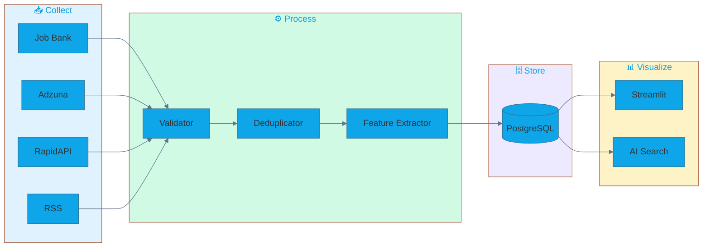
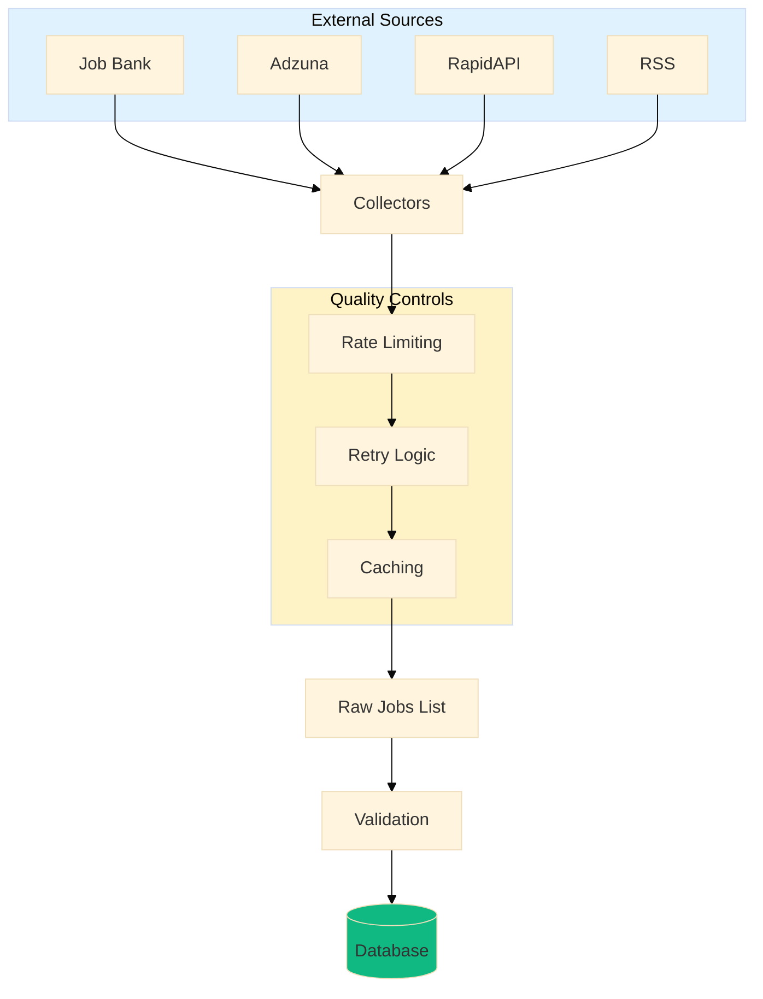
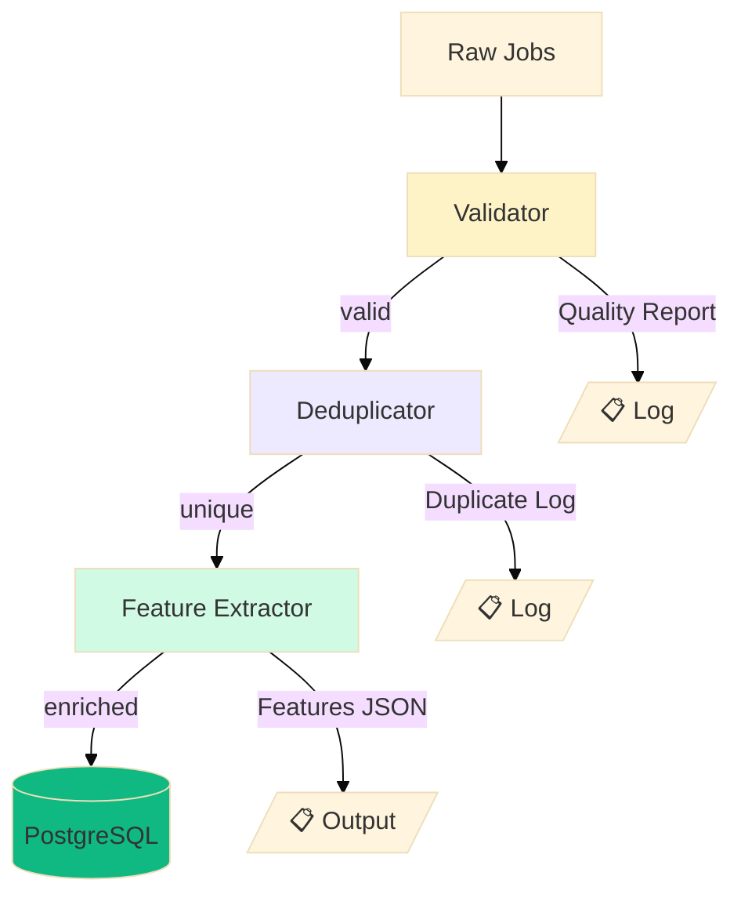

# System Architecture

## Overview
Canada Tech Job Compass is a data-driven job market analysis system that collects, processes, and analyzes tech job postings across Canadian cities. The architecture follows a pipeline pattern: **Collect → Process → Analyze → Visualize**.



## System Components

### 1. Data Collection Layer
**Purpose**: Aggregate job postings from multiple sources with quality controls

**Components**:
- `BaseCollector` (Abstract Base Class)
  - Standardizes data format across sources
  - Implements retry logic and rate limiting
  - Validates API/scrape responses
  
- `JobBankCollector` (Primary Source - 60%)
  - Web scraping using BeautifulSoup + Selenium fallback
  - Rate limit: 2.5s between requests
  - Handles pagination and dynamic content
  
- `RapidAPICollector` (Secondary Source - 20%)
  - RESTful API integration (Mantiks/FantasticJobs)
  - Request quota management (100-500/month free)
  - Response caching (24h TTL)
  
- `RSSCollector` (Supplementary - 20%)
  - RSS feed parser for Workopolis/Indeed
  - Lightweight, no rate limits
  - XML to standardized JSON conversion

**Data Flow**:



### 2. Data Processing Layer
**Purpose**: Clean, deduplicate, and extract features from raw job data

**Components**:
- `DataValidator`
  - 15+ validation rules (dates, salaries, required fields)
  - Data quality scoring (0-100%)
  - Error logging for failed validations
  
- `Deduplicator`
  - Hash-based duplicate detection (title + company + city)
  - Update-on-conflict strategy for job refreshes
  - Tracks job posting history
  
- `FeatureExtractor`
  - **Experience Extraction**: Regex + NLP for "3-5 years", "junior", etc.
  - **Skill Extraction**: spaCy NER + custom dictionary (500+ tech terms)
  - **Remote Detection**: Keyword matching ("remote", "hybrid", "work from home")
  - **Salary Normalization**: Convert ranges to min/mid/max integers
  - **Seniority Inference**: Map experience to entry/junior/mid/senior/lead

**Data Flow**:



### 3. Data Storage Layer
**Purpose**: Persistent storage with optimized queries for analysis

**Technology**: PostgreSQL (Supabase hosted)

**Schema Design**:

```mermaid
%%{init: {'theme':'base', 'themeVariables': { 'primaryColor':'#6366f1'}}}%%
erDiagram
    jobs_raw ||--o| jobs_features : "job_id"
    jobs_features }o--o{ skills_master : "skills JSONB"
    
    jobs_raw {
        bigserial id PK
        varchar job_id UK
        varchar source
        varchar title
        varchar company
        varchar city
        varchar province
        date posted_date
        varchar remote_type
        int salary_min
        int salary_max
        text url
    }
    
    jobs_features {
        varchar job_id PK_FK
        int exp_min
        int exp_max
        varchar exp_level
        jsonb skills
        boolean is_junior
        boolean is_remote
    }
    
    skills_master {
        varchar skill PK
        varchar category
        jsonb role_relevance
    }
```

```sql
-- Raw job data (immutable)
jobs_raw (
    id BIGSERIAL PRIMARY KEY,
    source VARCHAR(50),
    job_id VARCHAR(255) UNIQUE,  -- Source prefix + original ID
    title, company, city, province,
    description TEXT,
    salary_min, salary_max, salary_mid (computed),
    remote_type,
    posted_date DATE,
    url TEXT,
    scraped_at TIMESTAMP
)

-- Extracted features (derived)
jobs_features (
    job_id VARCHAR(255) FK → jobs_raw.job_id,
    exp_min, exp_max, exp_avg (computed),
    exp_level VARCHAR(20),
    skills JSONB,
    is_junior BOOLEAN (computed),
    is_remote BOOLEAN
)

-- Skills reference (seed data)
skills_master (
    skill VARCHAR(50) PRIMARY KEY,
    category VARCHAR(30),  -- programming, database, cloud, etc.
    role_relevance JSONB   -- Weighting per role
)

-- Metrics tracking
scraper_metrics (
    run_id UUID PRIMARY KEY,
    run_date TIMESTAMP,
    jobs_collected, jobs_failed,
    sources_used VARCHAR(100)[],
    avg_collection_time_ms,
    errors JSONB,
    success_rate DECIMAL(5,2)
)
```

**Indexes** (Performance Optimization):
```sql
CREATE INDEX idx_jobs_city ON jobs_raw(city);
CREATE INDEX idx_jobs_role ON jobs_raw(title);
CREATE INDEX idx_jobs_date ON jobs_raw(posted_date);
CREATE INDEX idx_features_skills ON jobs_features USING GIN(skills);
CREATE INDEX idx_job_dedup ON jobs_raw(MD5(LOWER(title) || company || city));
```

**Connection Management**:
- SQLAlchemy ORM with connection pooling
- Pool size: 5 connections, max overflow: 10
- Pre-ping enabled for stale connection detection
- Auto-commit disabled (explicit transactions)

### 4. Analysis Layer
**Purpose**: Generate insights and predictive models for job seekers

**Components**:
- `SQLQueryEngine`
  - Pre-built analytical queries (10+ templates)
  - Parameterized queries for city/role comparisons
  - Direct database access for Power BI via ODBC
  
- `InsightsGenerator`
  - Automated insight extraction (top 5-10 findings)
  - Natural language generation for reports
  - Confidence scoring for recommendations
  
- `MLPredictor` (Optional Enhancement)
  - Salary prediction (XGBoost regressor)
  - Job difficulty scoring (weighted formula)
  - Skill gap analysis (user skills vs market demand)
  - Application success probability

**Key Analyses**:
1. **Experience Ladder**: Avg experience by city/role, junior % breakdown
2. **Skills Heatmap**: Top skills demand by category and role
3. **Location Strategy**: Remote work availability, cost of living adjusted salaries
4. **Opportunity Score**: Composite metric (junior %, remote %, volume, exp required)
5. **Trend Analysis**: Skill demand growth over 30/60/90 days

### 5. Visualization Layer
**Purpose**: Interactive dashboard for job seekers

**Technology**: Power BI Desktop → Public Workspace

**Dashboard Structure** (5 Pages):
1. **Canada Heatmap**: Geographic job distribution
2. **Experience Ladder**: Career progression paths
3. **Skills Radar**: In-demand skills by role
4. **Location Strategy**: Where to apply for best odds
5. **Action Plan**: Personalized recommendations

**Data Pipeline**:
```
PostgreSQL → ODBC Connection → Power BI → Refresh (Daily via API) → Public URL
```

### 6. Orchestration Layer
**Purpose**: Automate end-to-end pipeline execution

**Components**:
- `CLIOrchestrator` (main.py)
  - Commands: collect, process, analyze, full_pipeline
  - Progress tracking and error recovery
  - Partial run support (resume from last checkpoint)
  
- `Scheduler`
  - **Development**: APScheduler (cron: daily at 2 AM)
  - **Production**: GitHub Actions workflow
  - Monitors pipeline health (alert if <1800 jobs collected)
  - Auto-retry on transient failures

**Pipeline Stages**:
```
Stage 1: Collect (30-60 min)
  → Fetch from Job Bank, RapidAPI, RSS
  → Target: 2,000+ jobs
  
Stage 2: Process (10-15 min)
  → Validate, deduplicate, extract features
  → Target: 90%+ data quality score
  
Stage 3: Analyze (5 min)
  → Run SQL queries, generate insights
  → Refresh Power BI materialized view
  
Stage 4: Monitor (ongoing)
  → Power BI auto-refreshes from database
  → Dashboard always shows live data
```

## Data Flow Diagram

```
┌─────────────────────────────────────────────────────────────┐
│                    DATA COLLECTION                          │
│  Job Bank (scraping) + RapidAPI + RSS Feeds                │
│         ↓ (Rate Limiting + Retry + Caching)                │
└─────────────────────────────────────────────────────────────┘
                          ↓
┌─────────────────────────────────────────────────────────────┐
│                   DATA PROCESSING                           │
│  Validation → Deduplication → Feature Extraction           │
│         ↓ (15+ Quality Checks)                             │
└─────────────────────────────────────────────────────────────┘
                          ↓
┌─────────────────────────────────────────────────────────────┐
│                   DATA STORAGE                              │
│  PostgreSQL (Supabase) - jobs_raw + jobs_features          │
│         ↓ (Indexed for fast queries)                       │
└─────────────────────────────────────────────────────────────┘
                          ↓
┌─────────────────────────────────────────────────────────────┐
│                   DATA ANALYSIS                             │
│  SQL Queries → Insights Generator → ML Predictions         │
│         ↓ (Refresh materialized views)                     │
└─────────────────────────────────────────────────────────────┘
                          ↓
┌─────────────────────────────────────────────────────────────┐
│                   VISUALIZATION                             │
│  Power BI Dashboard (5 pages) → Direct ODBC Connection     │
│         ↓ (Live data, auto-refresh)                        │
└─────────────────────────────────────────────────────────────┘
                          ↓
                    Job Seekers
```

## Technology Choices & Rationale

| Component | Technology | Why? |
|-----------|-----------|------|
| Language | Python 3.11+ | Rich data science ecosystem, easy scraping |
| Database | PostgreSQL | JSONB for skills, GIN indexes, computed columns |
| ORM | SQLAlchemy | Connection pooling, migration support |
| Scraping | BeautifulSoup + Selenium | BS4 for speed, Selenium for JS rendering |
| NLP | spaCy | Fast, accurate NER, small model footprint |
| Scheduling | APScheduler + GitHub Actions | Dev flexibility + prod reliability |
| Visualization | Power BI | Free public workspace, enterprise-grade features |
| Testing | pytest | Fixtures, mocking, coverage reporting |

## Scalability Considerations

### Current Capacity (MVP)
- **Jobs**: 2,000-5,000 jobs/day
- **Cities**: 7 cities (expandable to 50+)
- **Roles**: 7 roles (expandable to 30+)
- **Database**: Supabase free tier (500 MB, 2 GB bandwidth/month)

### Growth Path
1. **Phase 2 (10K jobs/day)**:
   - Add Indeed API, LinkedIn scraping
   - Upgrade Supabase to Pro ($25/month)
   - Implement Redis caching layer
   
2. **Phase 3 (50K jobs/day)**:
   - Migrate to Airflow for orchestration
   - Distributed scraping (Celery workers)
   - TimescaleDB for time-series analysis
   
3. **Phase 4 (Real-time)**:
   - WebSocket connections to job boards
   - Event-driven architecture (Kafka/RabbitMQ)
   - ML model serving (FastAPI endpoints)

## Security Architecture

### Secrets Management
- `.env` file (local development) - NEVER committed
- GitHub Secrets (production CI/CD)
- Supabase RLS (Row Level Security) for multi-tenant future

### API Security
- Rate limiting per IP/API key
- Request signing for webhook callbacks
- HTTPS-only connections

### Data Privacy
- No personal data storage (emails, phone numbers stripped)
- Anonymized company names in public exports
- GDPR-compliant data retention (30 days)

## Monitoring & Observability

### Logging
- **File Logs**: `logs/job_scraper.log` (10 MB rotation, 5 backups)
- **Levels**: DEBUG → INFO → WARNING → ERROR → CRITICAL
- **Structured Logging**: JSON format with context (job_id, source, city)

### Metrics Tracking
- Jobs collected per source/city/role
- Data quality scores (% valid jobs)
- Pipeline execution time per stage
- API rate limit usage (remaining quota)
- Database query performance (slow query log)

### Alerting (Future)
- Email/Slack alerts if:
  - <1800 jobs collected in 24h
  - >50 errors in single run
  - <90% data quality score
  - API rate limit exceeded
  - Database connection failures

## Deployment Architecture

### Local Development
```
Developer Machine
├── Python 3.11 venv
├── PostgreSQL client (psql)
├── Chrome/Chromium (for Selenium)
├── Power BI Desktop
└── Git repository
```

### Production (GitHub Actions)
```
GitHub Actions Runner (Ubuntu 22.04)
├── Python 3.11
├── Chrome headless
├── Supabase connection (cloud PostgreSQL)
├── Secrets from GitHub Secrets
└── Power BI gateway (optional for scheduled refresh)
```

## Error Handling Strategy

### Retry Logic
- **Network errors**: 3 retries with exponential backoff (2s, 4s, 8s)
- **Rate limits**: Wait for reset time + 10s buffer
- **Parse errors**: Log and skip, continue with next job

### Graceful Degradation
- If Job Bank fails → Use RapidAPI + RSS only
- If all sources fail → Alert and use cached data
- If feature extraction fails → Store raw job, retry later

### Recovery Procedures
- **Partial run support**: Resume from last successful batch
- **Checkpoint files**: Save state after each 100 jobs
- **Idempotent operations**: Safe to re-run without duplicates

## Performance Optimization

### Database Optimizations
- Bulk inserts (500 jobs/batch) → 100x faster than individual
- Connection pooling (reuse 5 connections)
- Materialized views for common aggregations
- Partial indexes for filtered queries

### Scraping Optimizations
- Async requests (aiohttp) for independent pages
- Response caching (24h TTL for API responses)
- Lazy loading of spaCy models (once per run)
- HTML compression in storage (50% space savings)

### Query Optimizations
- Use CTEs for complex joins
- EXPLAIN ANALYZE for slow queries (>100ms)
- Index-only scans where possible
- Avoid SELECT * (fetch only needed columns)

## Future Enhancements

### Short-term (3-6 months)
- [ ] Mobile-responsive dashboard
- [ ] Email alerts for new matching jobs
- [ ] Resume keyword optimizer
- [ ] Interview preparation resources

### Long-term (6-12 months)
- [ ] AI-powered cover letter generator
- [ ] Salary negotiation calculator
- [ ] Career path predictor (role transitions)
- [ ] Company culture analysis (Glassdoor integration)

---

**Architecture Version**: 1.0  
**Last Updated**: 2026-02-20  
**Next Review**: 2026-03-20
