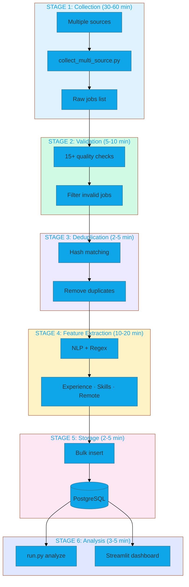

# Data Pipeline Documentation

## Overview
The data pipeline transforms raw job postings into structured, analyzed data ready for visualization. Pipeline stages: **Collect → Validate → Deduplicate → Extract Features → Store → Analyze**.

## Pipeline Architecture



## Stage 1: Data Collection

### Objective
Collect 2,000+ job postings from multiple sources within 30-60 minutes.

### Implementation
```python
# src/collectors/orchestrator.py

from typing import List, Dict
import logging
from concurrent.futures import ThreadPoolExecutor, as_completed

logger = logging.getLogger(__name__)

class DataCollectionPipeline:
    """Orchestrate data collection from all sources."""
    
    TARGET_JOBS = 2200
    CITIES = ['Toronto', 'Saskatoon', 'Regina', 'Calgary', 'Edmonton', 'Winnipeg', 'Vancouver']
    ROLES = [
        'data analyst', 'it support', 'full stack developer', 
        'devops', 'web designer', 'business analyst', 'qa tester'
    ]
    
    def __init__(self):
        self.jobbank = JobBankCollector(config={})
        self.rapidapi = RapidAPICollector()
        self.rss = RSSCollector()
        
        self.collected_jobs = []
        self.errors = []
    
    def run(self, parallel: bool = True) -> List[Dict]:
        """
        Run collection pipeline.
        
        Args:
            parallel: Use parallel collection (faster)
            
        Returns:
            List of raw job dictionaries
        """
        logger.info("Starting data collection pipeline")
        
        if parallel:
            return self._collect_parallel()
        else:
            return self._collect_sequential()
    
    def _collect_parallel(self) -> List[Dict]:
        """Collect jobs in parallel using ThreadPoolExecutor."""
        tasks = []
        
        # Generate all city-role combinations
        for city in self.CITIES:
            for role in self.ROLES:
                tasks.append(('jobbank', city, role))
                tasks.append(('rapidapi', city, role))
                tasks.append(('rss', city, role))
        
        # Execute with thread pool
        with ThreadPoolExecutor(max_workers=10) as executor:
            futures = {
                executor.submit(self._collect_task, source, city, role): (source, city, role)
                for source, city, role in tasks
            }
            
            for future in as_completed(futures):
                source, city, role = futures[future]
                try:
                    jobs = future.result()
                    self.collected_jobs.extend(jobs)
                    logger.info(f"Collected {len(jobs)} jobs: {source} - {city} - {role}")
                except Exception as e:
                    error_msg = f"Failed {source} - {city} - {role}: {e}"
                    logger.error(error_msg)
                    self.errors.append(error_msg)
        
        logger.info(f"Total jobs collected: {len(self.collected_jobs)}")
        return self.collected_jobs
    
    def _collect_task(self, source: str, city: str, role: str) -> List[Dict]:
        """Single collection task for parallel execution."""
        if source == 'jobbank':
            return self.jobbank.collect(city, role, max_pages=3)
        elif source == 'rapidapi':
            province = self._city_to_province(city)
            return self.rapidapi.collect(province, role, limit=50)
        elif source == 'rss':
            workopolis = self.rss.collect_workopolis(city, role)
            indeed = self.rss.collect_indeed(city, role)
            return workopolis + indeed
        return []
    
    def _city_to_province(self, city: str) -> str:
        """Map city to province code."""
        mapping = {
            'Toronto': 'ON', 'Calgary': 'AB', 'Edmonton': 'AB',
            'Vancouver': 'BC', 'Saskatoon': 'SK', 'Regina': 'SK',
            'Winnipeg': 'MB'
        }
        return mapping.get(city, 'ON')
    
    def get_statistics(self) -> Dict:
        """Generate collection statistics."""
        by_source = {}
        for job in self.collected_jobs:
            source = job.get('source', 'unknown')
            by_source[source] = by_source.get(source, 0) + 1
        
        return {
            'total_jobs': len(self.collected_jobs),
            'by_source': by_source,
            'errors': len(self.errors),
            'target_met': len(self.collected_jobs) >= self.TARGET_JOBS
        }
```

### Output Format
```json
[
    {
        "source": "jobbank",
        "job_id": "jobbank_12345",
        "title": "Data Analyst",
        "company": "Tech Corp",
        "city": "Toronto",
        "province": "ON",
        "description": "We are seeking...",
        "salary_min": 60000,
        "salary_max": 80000,
        "remote_type": null,
        "posted_date": "2026-02-15",
        "url": "https://www.jobbank.gc.ca/jobsearch/jobposting/12345"
    }
]
```

## Stage 2: Data Validation

### Objective
Ensure data quality by validating 15+ rules and filtering invalid jobs.

### Validation Rules
```python
# src/processors/validator.py

from dataclasses import dataclass
from typing import List, Tuple, Dict
from datetime import datetime, timedelta
import logging

logger = logging.getLogger(__name__)

@dataclass
class ValidationResult:
    """Result of job validation."""
    is_valid: bool
    errors: List[str]
    warnings: List[str]
    quality_score: float  # 0-100

class DataValidator:
    """Validate job data quality."""
    
    # Validation thresholds
    MIN_TITLE_LENGTH = 3
    MAX_TITLE_LENGTH = 200
    MIN_DESCRIPTION_LENGTH = 50
    MAX_AGE_DAYS = 30
    MIN_SALARY = 30_000
    MAX_SALARY = 250_000
    
    REQUIRED_FIELDS = ['source', 'job_id', 'title', 'city', 'url']
    OPTIONAL_FIELDS = ['company', 'province', 'description', 'salary_min', 'salary_max', 'posted_date']
    
    def validate_job(self, job: Dict) -> ValidationResult:
        """
        Validate single job against all rules.
        
        Args:
            job: Job dictionary
            
        Returns:
            ValidationResult with errors, warnings, and quality score
        """
        errors = []
        warnings = []
        
        # Rule 1: Required fields present
        for field in self.REQUIRED_FIELDS:
            if field not in job or not job[field]:
                errors.append(f"Missing required field: {field}")
        
        # Rule 2: Title length
        title = job.get('title', '')
        if len(title) < self.MIN_TITLE_LENGTH:
            errors.append(f"Title too short: {len(title)} chars")
        elif len(title) > self.MAX_TITLE_LENGTH:
            warnings.append(f"Title very long: {len(title)} chars")
        
        # Rule 3: Description length
        description = job.get('description', '')
        if description and len(description) < self.MIN_DESCRIPTION_LENGTH:
            warnings.append(f"Description too short: {len(description)} chars")
        
        # Rule 4: Valid city
        city = job.get('city', '')
        if not self._is_valid_city(city):
            errors.append(f"Invalid or unknown city: {city}")
        
        # Rule 5: Valid province
        province = job.get('province', '')
        if province and not self._is_valid_province(province):
            errors.append(f"Invalid province code: {province}")
        
        # Rule 6: Posted date validation
        posted_date = job.get('posted_date')
        if posted_date:
            date_errors = self._validate_date(posted_date)
            errors.extend(date_errors)
        
        # Rule 7: Salary sanity check
        salary_min = job.get('salary_min')
        salary_max = job.get('salary_max')
        if salary_min or salary_max:
            salary_errors = self._validate_salary(salary_min, salary_max)
            errors.extend(salary_errors)
        
        # Rule 8: URL format
        url = job.get('url', '')
        if url and not url.startswith('http'):
            errors.append(f"Invalid URL format: {url}")
        
        # Rule 9: Job ID uniqueness format
        job_id = job.get('job_id', '')
        if not job_id.startswith(job.get('source', '') + '_'):
            warnings.append(f"Job ID doesn't match source prefix: {job_id}")
        
        # Rule 10: Remote type (if provided)
        remote_type = job.get('remote_type')
        if remote_type and remote_type not in ['remote', 'hybrid', 'onsite']:
            warnings.append(f"Unknown remote type: {remote_type}")
        
        # Calculate quality score
        quality_score = self._calculate_quality_score(job, errors, warnings)
        
        is_valid = len(errors) == 0
        
        return ValidationResult(
            is_valid=is_valid,
            errors=errors,
            warnings=warnings,
            quality_score=quality_score
        )
    
    def _is_valid_city(self, city: str) -> bool:
        """Check if city is in our target list."""
        valid_cities = [
            'Toronto', 'Saskatoon', 'Regina', 'Calgary', 
            'Edmonton', 'Winnipeg', 'Vancouver', 'Ottawa',
            'Montreal', 'Mississauga', 'Brampton'
        ]
        return city in valid_cities or len(city) > 2
    
    def _is_valid_province(self, province: str) -> bool:
        """Check if province code is valid."""
        valid_provinces = ['ON', 'SK', 'AB', 'BC', 'MB', 'QC', 'NS', 'NB', 'PE', 'NL', 'YT', 'NT', 'NU']
        return province.upper() in valid_provinces
    
    def _validate_date(self, date_str: str) -> List[str]:
        """Validate posted date."""
        errors = []
        
        try:
            posted_date = datetime.fromisoformat(date_str)
            
            # Future date check
            if posted_date > datetime.now():
                errors.append(f"Future date: {date_str}")
            
            # Too old check
            age = (datetime.now() - posted_date).days
            if age > self.MAX_AGE_DAYS:
                errors.append(f"Job too old: {age} days")
        
        except (ValueError, TypeError):
            errors.append(f"Invalid date format: {date_str}")
        
        return errors
    
    def _validate_salary(self, salary_min: int, salary_max: int) -> List[str]:
        """Validate salary range."""
        errors = []
        
        if salary_min is not None:
            if salary_min < self.MIN_SALARY or salary_min > self.MAX_SALARY:
                errors.append(f"Unrealistic salary_min: ${salary_min:,}")
        
        if salary_max is not None:
            if salary_max < self.MIN_SALARY or salary_max > self.MAX_SALARY:
                errors.append(f"Unrealistic salary_max: ${salary_max:,}")
        
        if salary_min and salary_max and salary_min > salary_max:
            errors.append(f"salary_min > salary_max: ${salary_min:,} > ${salary_max:,}")
        
        return errors
    
    def _calculate_quality_score(self, job: Dict, errors: List[str], warnings: List[str]) -> float:
        """
        Calculate quality score (0-100).
        
        Scoring:
        - Start at 100
        - Deduct 10 points per error
        - Deduct 2 points per warning
        - Bonus points for optional fields filled
        """
        score = 100.0
        
        # Deductions
        score -= len(errors) * 10
        score -= len(warnings) * 2
        
        # Bonuses for completeness
        optional_filled = sum(1 for field in self.OPTIONAL_FIELDS if job.get(field))
        score += (optional_filled / len(self.OPTIONAL_FIELDS)) * 10
        
        return max(0.0, min(100.0, score))
    
    def validate_batch(self, jobs: List[Dict]) -> Tuple[List[Dict], Dict]:
        """
        Validate batch of jobs.
        
        Args:
            jobs: List of job dictionaries
            
        Returns:
            Tuple of (valid_jobs, statistics)
        """
        valid_jobs = []
        invalid_count = 0
        total_errors = []
        total_warnings = []
        quality_scores = []
        
        for job in jobs:
            result = self.validate_job(job)
            
            if result.is_valid:
                valid_jobs.append(job)
                quality_scores.append(result.quality_score)
            else:
                invalid_count += 1
                total_errors.extend(result.errors)
            
            total_warnings.extend(result.warnings)
        
        stats = {
            'total_jobs': len(jobs),
            'valid_jobs': len(valid_jobs),
            'invalid_jobs': invalid_count,
            'validation_rate': len(valid_jobs) / len(jobs) * 100 if jobs else 0,
            'avg_quality_score': sum(quality_scores) / len(quality_scores) if quality_scores else 0,
            'total_errors': len(total_errors),
            'total_warnings': len(total_warnings),
            'top_errors': self._count_errors(total_errors)
        }
        
        logger.info(f"Validation complete: {len(valid_jobs)}/{len(jobs)} valid ({stats['validation_rate']:.1f}%)")
        
        return valid_jobs, stats
    
    def _count_errors(self, errors: List[str]) -> Dict[str, int]:
        """Count error types."""
        error_counts = {}
        for error in errors:
            error_type = error.split(':')[0]
            error_counts[error_type] = error_counts.get(error_type, 0) + 1
        
        # Return top 5 errors
        sorted_errors = sorted(error_counts.items(), key=lambda x: x[1], reverse=True)
        return dict(sorted_errors[:5])
```

### Output
```python
{
    'valid_jobs': 1847,
    'invalid_jobs': 153,
    'validation_rate': 92.35,
    'avg_quality_score': 87.3,
    'top_errors': {
        'Missing required field': 45,
        'Invalid date format': 32,
        'Job too old': 28,
        'Title too short': 18,
        'Unrealistic salary': 12
    }
}
```

## Stage 3: Deduplication

### Objective
Remove duplicate job postings using hash-based matching.

### Implementation
```python
# src/processors/deduplicator.py

import hashlib
from typing import List, Dict, Set
import logging

logger = logging.getLogger(__name__)

class Deduplicator:
    """Remove duplicate jobs using multiple strategies."""
    
    def __init__(self):
        self.seen_hashes: Set[str] = set()
        self.duplicates_found = 0
    
    def deduplicate(self, jobs: List[Dict]) -> List[Dict]:
        """
        Remove duplicates from job list.
        
        Strategy: Hash combination of (title + company + city)
        
        Args:
            jobs: List of job dictionaries
            
        Returns:
            Deduplicated job list
        """
        unique_jobs = []
        
        for job in jobs:
            job_hash = self._compute_hash(job)
            
            if job_hash not in self.seen_hashes:
                self.seen_hashes.add(job_hash)
                unique_jobs.append(job)
            else:
                self.duplicates_found += 1
                logger.debug(f"Duplicate found: {job.get('title')} at {job.get('company')}")
        
        dedup_rate = (1 - len(unique_jobs) / len(jobs)) * 100 if jobs else 0
        
        logger.info(
            f"Deduplication complete: {len(unique_jobs)} unique / {len(jobs)} total "
            f"({dedup_rate:.1f}% duplicates removed)"
        )
        
        return unique_jobs
    
    def _compute_hash(self, job: Dict) -> str:
        """
        Compute unique hash for job.
        
        Hash components:
        - Title (normalized: lowercase, stripped)
        - Company (normalized)
        - City (normalized)
        
        Returns:
            SHA256 hash (first 16 chars)
        """
        title = job.get('title', '').lower().strip()
        company = job.get('company', '').lower().strip()
        city = job.get('city', '').lower().strip()
        
        # Normalize common variations
        title = self._normalize_title(title)
        company = self._normalize_company(company)
        
        # Compute hash
        hash_input = f"{title}|{company}|{city}"
        hash_value = hashlib.sha256(hash_input.encode()).hexdigest()[:16]
        
        return hash_value
    
    def _normalize_title(self, title: str) -> str:
        """Normalize job title for matching."""
        # Remove common suffixes
        title = title.replace(' - remote', '')
        title = title.replace(' (remote)', '')
        
        # Standardize separators
        title = title.replace('/', ' ')
        
        return title.strip()
    
    def _normalize_company(self, company: str) -> str:
        """Normalize company name for matching."""
        # Remove legal suffixes
        for suffix in [' inc.', ' inc', ' ltd.', ' ltd', ' corp.', ' corp', ' llc']:
            if company.endswith(suffix):
                company = company[:-len(suffix)]
        
        return company.strip()
    
    def get_statistics(self) -> Dict:
        """Get deduplication statistics."""
        return {
            'unique_jobs': len(self.seen_hashes),
            'duplicates_removed': self.duplicates_found,
            'deduplication_rate': (
                self.duplicates_found / (len(self.seen_hashes) + self.duplicates_found) * 100
                if self.seen_hashes else 0
            )
        }
```

## Stage 4: Feature Extraction

### Objective
Extract structured features: experience, skills, remote status, seniority level.

### Implementation
```python
# src/processors/feature_extractor.py

import re
import spacy
from typing import Dict, List, Optional, Tuple
import logging

logger = logging.getLogger(__name__)

class FeatureExtractor:
    """Extract features from job descriptions using NLP."""
    
    # Experience patterns
    EXPERIENCE_PATTERNS = [
        r'(\d+)\s*(?:to|-|–)\s*(\d+)\s*(?:years?|yrs?)',  # "3-5 years"
        r'(\d+)\+\s*(?:years?|yrs?)',                      # "3+ years"
        r'minimum\s+(?:of\s+)?(\d+)\s*(?:years?|yrs?)',   # "minimum 3 years"
        r'at\s+least\s+(\d+)\s*(?:years?|yrs?)',          # "at least 3 years"
        r'(\d+)\s*(?:years?|yrs?)\s+(?:of\s+)?experience',  # "3 years experience"
    ]
    
    # Entry-level keywords
    ENTRY_KEYWORDS = [
        'entry level', 'junior', 'graduate', 'intern', 'co-op',
        'fresh grad', 'new grad', 'no experience', '0 years'
    ]
    
    # Senior-level keywords
    SENIOR_KEYWORDS = [
        'senior', 'lead', 'principal', 'staff', 'expert',
        'architect', 'head of', 'director', 'manager'
    ]
    
    # Remote keywords
    REMOTE_KEYWORDS = [
        'remote', 'work from home', 'wfh', 'telecommute', 'distributed',
        'virtual', 'anywhere', 'home-based'
    ]
    
    HYBRID_KEYWORDS = ['hybrid', 'flexible', 'partial remote', 'mix of']
    
    def __init__(self):
        """Initialize with spaCy model."""
        try:
            self.nlp = spacy.load('en_core_web_sm')
            logger.info("spaCy model loaded successfully")
        except OSError:
            logger.warning("spaCy model not found. Run: python -m spacy download en_core_web_sm")
            self.nlp = None
    
    def extract_features(self, job: Dict) -> Dict:
        """
        Extract all features from job.
        
        Args:
            job: Job dictionary with 'description' field
            
        Returns:
            Features dictionary
        """
        description = job.get('description', '').lower()
        title = job.get('title', '').lower()
        
        features = {
            'job_id': job.get('job_id'),
            'exp_min': None,
            'exp_max': None,
            'exp_level': None,
            'skills': [],
            'is_remote': False,
            'remote_type': None
        }
        
        # Extract experience
        exp_min, exp_max = self._extract_experience(description, title)
        features['exp_min'] = exp_min
        features['exp_max'] = exp_max
        features['exp_level'] = self._infer_seniority(exp_min, exp_max, title)
        
        # Extract skills
        features['skills'] = self._extract_skills(description)
        
        # Detect remote work
        is_remote, remote_type = self._detect_remote(description, title)
        features['is_remote'] = is_remote
        features['remote_type'] = remote_type
        
        return features
    
    def _extract_experience(self, description: str, title: str) -> Tuple[Optional[int], Optional[int]]:
        """
        Extract experience requirements.
        
        Returns:
            Tuple of (min_years, max_years)
        """
        text = description + ' ' + title
        
        # Check for entry-level keywords
        if any(keyword in text for keyword in self.ENTRY_KEYWORDS):
            return 0, 1
        
        # Try regex patterns
        for pattern in self.EXPERIENCE_PATTERNS:
            matches = re.findall(pattern, text, re.IGNORECASE)
            if matches:
                match = matches[0]
                if isinstance(match, tuple):
                    if len(match) == 2:
                        # Range: "3-5 years"
                        return int(match[0]), int(match[1])
                    else:
                        # Single value: "3+ years"
                        return int(match[0]), None
                else:
                    return int(match), None
        
        # No explicit experience found
        return None, None
    
    def _infer_seniority(self, exp_min: Optional[int], exp_max: Optional[int], title: str) -> str:
        """
        Infer seniority level.
        
        Returns:
            'entry', 'junior', 'mid', 'senior', or 'lead'
        """
        # Check title first
        if any(keyword in title for keyword in self.SENIOR_KEYWORDS):
            return 'senior'
        if any(keyword in title for keyword in self.ENTRY_KEYWORDS):
            return 'entry'
        
        # Infer from experience
        if exp_min is not None:
            if exp_min == 0:
                return 'entry'
            elif exp_min <= 2:
                return 'junior'
            elif exp_min <= 5:
                return 'mid'
            elif exp_min <= 8:
                return 'senior'
            else:
                return 'lead'
        
        # Default to mid if no info
        return 'mid'
    
    def _extract_skills(self, description: str) -> List[str]:
        """
        Extract technical skills from description.
        
        Uses:
        1. Custom skill dictionary (500+ tech terms)
        2. spaCy NER for additional terms
        
        Returns:
            List of skill strings (lowercase)
        """
        skills_found = set()
        
        # Load skills from database or config
        skill_dictionary = self._load_skill_dictionary()
        
        # Match against dictionary
        for skill in skill_dictionary:
            # Use word boundaries to avoid partial matches
            pattern = r'\b' + re.escape(skill.lower()) + r'\b'
            if re.search(pattern, description):
                skills_found.add(skill.lower())
        
        # Use spaCy NER for additional technical terms
        if self.nlp:
            doc = self.nlp(description[:10000])  # Limit text length for performance
            for ent in doc.ents:
                if ent.label_ in ['PRODUCT', 'ORG']:  # Tech products/tools
                    skills_found.add(ent.text.lower())
        
        return sorted(list(skills_found))
    
    def _load_skill_dictionary(self) -> List[str]:
        """
        Load skill dictionary from database or config.
        
        Returns:
            List of skill keywords
        """
        # Core tech skills (abbreviated list - full list in skills_master table)
        skills = [
            # Programming Languages
            'python', 'java', 'javascript', 'typescript', 'c++', 'c#', 'go', 'ruby', 
            'php', 'swift', 'kotlin', 'scala', 'rust', 'r',
            
            # Databases
            'sql', 'postgresql', 'mysql', 'mongodb', 'redis', 'cassandra', 'oracle',
            'dynamodb', 'elasticsearch',
            
            # Cloud Platforms
            'aws', 'azure', 'gcp', 'google cloud', 'amazon web services',
            
            # DevOps
            'docker', 'kubernetes', 'jenkins', 'terraform', 'ansible', 'ci/cd',
            'git', 'github', 'gitlab', 'bitbucket',
            
            # Visualization
            'power bi', 'tableau', 'looker', 'qlik', 'grafana',
            
            # Frameworks
            'react', 'angular', 'vue', 'node.js', 'express', 'django', 'flask',
            'spring', 'spring boot', '.net', 'asp.net',
            
            # Other
            'machine learning', 'deep learning', 'nlp', 'computer vision',
            'agile', 'scrum', 'jira', 'excel', 'powerpoint'
        ]
        
        return skills
    
    def _detect_remote(self, description: str, title: str) -> Tuple[bool, Optional[str]]:
        """
        Detect remote work options.
        
        Returns:
            Tuple of (is_remote, remote_type)
            remote_type: 'remote', 'hybrid', or 'onsite'
        """
        text = description + ' ' + title
        
        # Check for remote keywords
        if any(keyword in text for keyword in self.REMOTE_KEYWORDS):
            return True, 'remote'
        
        # Check for hybrid keywords
        if any(keyword in text for keyword in self.HYBRID_KEYWORDS):
            return True, 'hybrid'
        
        # Default to onsite
        return False, 'onsite'
    
    def extract_batch(self, jobs: List[Dict]) -> List[Dict]:
        """
        Extract features for batch of jobs.
        
        Args:
            jobs: List of job dictionaries
            
        Returns:
            List of feature dictionaries
        """
        features_list = []
        
        for job in jobs:
            try:
                features = self.extract_features(job)
                features_list.append(features)
            except Exception as e:
                logger.error(f"Feature extraction failed for job {job.get('job_id')}: {e}")
                # Add empty features
                features_list.append({
                    'job_id': job.get('job_id'),
                    'exp_min': None,
                    'exp_max': None,
                    'exp_level': 'mid',
                    'skills': [],
                    'is_remote': False,
                    'remote_type': 'onsite'
                })
        
        logger.info(f"Extracted features for {len(features_list)} jobs")
        
        return features_list
```

## Stage 5: Database Storage

### Objective
Store jobs and features in PostgreSQL with bulk inserts for performance.

### Implementation
```python
# src/database/storage.py

from sqlalchemy import create_engine
from sqlalchemy.orm import sessionmaker, Session
from contextlib import contextmanager
from typing import List, Dict
import logging

logger = logging.getLogger(__name__)

class DatabaseStorage:
    """Handle database operations with bulk inserts."""
    
    def __init__(self, connection_url: str):
        """Initialize database connection."""
        self.engine = create_engine(
            connection_url,
            pool_size=5,
            max_overflow=10,
            pool_pre_ping=True
        )
        self.SessionLocal = sessionmaker(bind=self.engine)
    
    @contextmanager
    def get_session(self):
        """Get database session with transaction management."""
        session = self.SessionLocal()
        try:
            yield session
            session.commit()
        except Exception as e:
            session.rollback()
            logger.error(f"Database transaction failed: {e}")
            raise
        finally:
            session.close()
    
    def bulk_insert_jobs(self, jobs: List[Dict], batch_size: int = 500):
        """
        Bulk insert jobs into jobs_raw table.
        
        Args:
            jobs: List of job dictionaries
            batch_size: Number of jobs per batch (default: 500)
        """
        with self.get_session() as session:
            for i in range(0, len(jobs), batch_size):
                batch = jobs[i:i+batch_size]
                
                # Use bulk_insert_mappings for performance
                session.bulk_insert_mappings(JobRaw, batch)
                
                logger.info(f"Inserted batch {i//batch_size + 1}: {len(batch)} jobs")
        
        logger.info(f"Total jobs inserted: {len(jobs)}")
    
    def bulk_insert_features(self, features: List[Dict], batch_size: int = 500):
        """
        Bulk insert features into jobs_features table.
        
        Args:
            features: List of feature dictionaries
            batch_size: Number of features per batch
        """
        # Convert skills list to JSONB format
        for feature in features:
            if 'skills' in feature and isinstance(feature['skills'], list):
                feature['skills'] = json.dumps(feature['skills'])
        
        with self.get_session() as session:
            for i in range(0, len(features), batch_size):
                batch = features[i:i+batch_size]
                session.bulk_insert_mappings(JobFeatures, batch)
                logger.info(f"Inserted batch {i//batch_size + 1}: {len(batch)} features")
        
        logger.info(f"Total features inserted: {len(features)}")
```

## Stage 6: Analysis & Insights

### Objective
Run SQL queries, generate insights, refresh Power BI dashboard via direct database connection.

### Implementation
```python
# src/analyzers/insights_generator.py

import pandas as pd
from sqlalchemy import create_engine
from typing import Dict, List
import logging

logger = logging.getLogger(__name__)

class InsightsGenerator:
    """Generate insights from analyzed data."""
    
    def __init__(self, db_url: str):
        self.engine = create_engine(db_url)
    
    def generate_all_insights(self) -> Dict:
        """Generate all insights and export data."""
        insights = {}
        
        # Query 1: Experience by city/role
        insights['experience_ladder'] = self._get_experience_ladder()
        
        # Query 2: Top skills by role
        insights['skills_demand'] = self._get_skills_demand()
        
        # Query 3: Remote work availability
        insights['remote_stats'] = self._get_remote_stats()
        
        # Query 4: City competitiveness
        insights['city_scores'] = self._get_city_scores()
        
        # Export for Power BI
        self._export_for_powerbi()
        
        return insights
    
    def _get_experience_ladder(self) -> pd.DataFrame:
        """Get average experience by city and role."""
        query = """
            SELECT 
                jr.title as role,
                jr.city,
                jr.province,
                ROUND(AVG(jf.exp_min), 1) as avg_exp_min,
                ROUND(AVG(jf.exp_max), 1) as avg_exp_max,
                ROUND(100.0 * AVG(jf.is_junior::int), 1) as junior_pct,
                COUNT(*) as job_count
            FROM jobs_raw jr
            JOIN jobs_features jf ON jr.job_id = jf.job_id
            WHERE jr.posted_date >= CURRENT_DATE - INTERVAL '30 days'
            GROUP BY jr.title, jr.city, jr.province
            HAVING COUNT(*) >= 5
            ORDER BY junior_pct DESC
        """
        
        return pd.read_sql(query, self.engine)
    
    def _export_for_powerbi(self):
        """Export denormalized data for Power BI."""
        query = """
            SELECT 
                jr.job_id,
                jr.source,
                jr.title,
                jr.company,
                jr.city,
                jr.province,
                jr.salary_min,
                jr.salary_max,
                jr.salary_mid,
                jr.remote_type,
                jr.posted_date,
                jf.exp_min,
                jf.exp_max,
                jf.exp_level,
                jf.is_junior,
                jf.is_remote,
                jf.skills::text as skills
            FROM jobs_raw jr
            LEFT JOIN jobs_features jf ON jr.job_id = jf.job_id
            WHERE jr.posted_date >= CURRENT_DATE - INTERVAL '30 days'
        """
        
        # Refresh materialized view for Power BI
        with self.engine.connect() as conn:
            conn.execute(text("REFRESH MATERIALIZED VIEW mv_powerbi_export"))
            conn.commit()
        
        logger.info("Power BI materialized view refreshed - dashboard will auto-update")
```

## Pipeline Orchestration

### Full Pipeline Runner
```python
# src/main.py

import click
from collectors.orchestrator import DataCollectionPipeline
from processors.validator import DataValidator
from processors.deduplicator import Deduplicator
from processors.feature_extractor import FeatureExtractor
from database.storage import DatabaseStorage
from analyzers.insights_generator import InsightsGenerator
import logging

logging.basicConfig(level=logging.INFO)
logger = logging.getLogger(__name__)

@click.command()
@click.option('--parallel/--sequential', default=True, help='Collection mode')
def run_full_pipeline(parallel: bool):
    """Run complete data pipeline."""
    
    logger.info("=" * 60)
    logger.info("CANADA TECH JOB COMPASS - DATA PIPELINE")
    logger.info("=" * 60)
    
    # Stage 1: Collection
    logger.info("\n[STAGE 1] Data Collection")
    collector = DataCollectionPipeline()
    raw_jobs = collector.run(parallel=parallel)
    logger.info(f"✓ Collected {len(raw_jobs)} jobs")
    
    # Stage 2: Validation
    logger.info("\n[STAGE 2] Data Validation")
    validator = DataValidator()
    valid_jobs, val_stats = validator.validate_batch(raw_jobs)
    logger.info(f"✓ Validated {len(valid_jobs)} jobs ({val_stats['validation_rate']:.1f}%)")
    
    # Stage 3: Deduplication
    logger.info("\n[STAGE 3] Deduplication")
    deduplicator = Deduplicator()
    unique_jobs = deduplicator.deduplicate(valid_jobs)
    logger.info(f"✓ {len(unique_jobs)} unique jobs")
    
    # Stage 4: Feature Extraction
    logger.info("\n[STAGE 4] Feature Extraction")
    extractor = FeatureExtractor()
    features = extractor.extract_batch(unique_jobs)
    logger.info(f"✓ Extracted features for {len(features)} jobs")
    
    # Stage 5: Storage
    logger.info("\n[STAGE 5] Database Storage")
    storage = DatabaseStorage(os.getenv('SUPABASE_DB_URL'))
    storage.bulk_insert_jobs(unique_jobs)
    storage.bulk_insert_features(features)
    logger.info("✓ Stored in database")
    
    # Stage 6: Analysis
    logger.info("\n[STAGE 6] Analysis & Export")
    analyzer = InsightsGenerator(os.getenv('SUPABASE_DB_URL'))
    insights = analyzer.generate_all_insights()
    logger.info("✓ Insights generated")
    
    logger.info("\n" + "=" * 60)
    logger.info("PIPELINE COMPLETE")
    logger.info("=" * 60)

if __name__ == '__main__':
    run_full_pipeline()
```

---

**Document Version**: 1.0  
**Last Updated**: 2026-02-20  
**Next Review**: 2026-03-20
